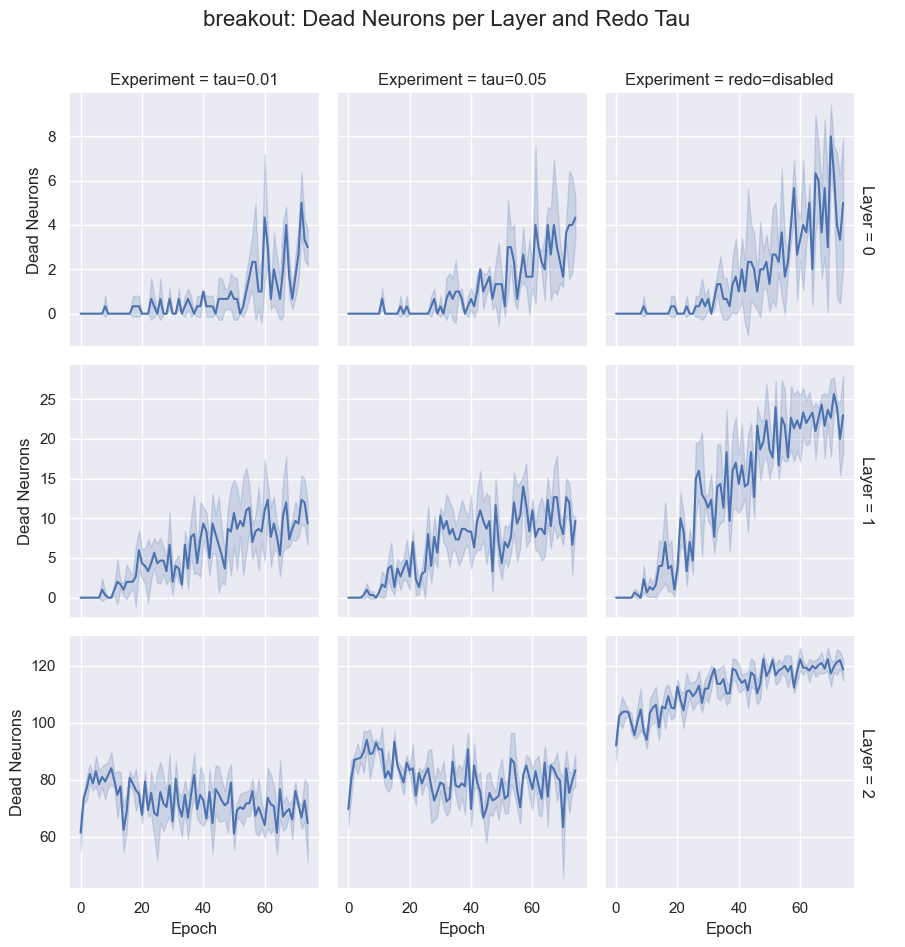
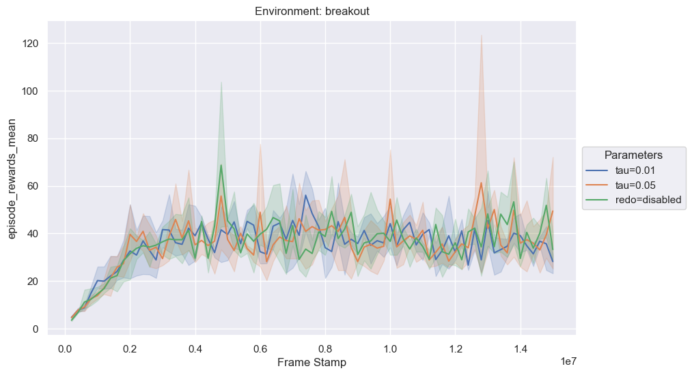

# minatar_work

This repository contains a learning project for my PhD research.

The broad topics that are approached are: Reinforcement Learning, Deep Learning, Network Compression.

The specific work consists in creating and training a DQN agent in minatar environments, and then studying the effects of network compression. 

## Files and folders of interest:

- minatar_dqn: contains the code for a RL DQN agent
- experiments: contains subfolders that group code and outputs of training and pruning experiments

## Results and analysis

### 2023/12/12: Redo validation

#### Number of dead neurons

#### Performance

#### Discussion

Performance is the same, while the number of dead neurons is kept constant by applying the redo resets.